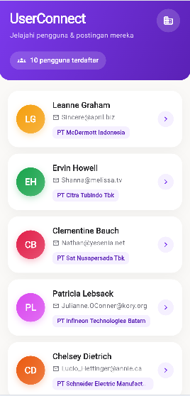
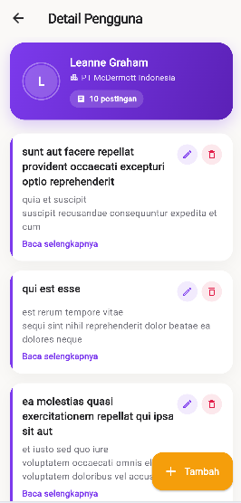
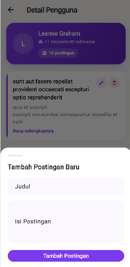
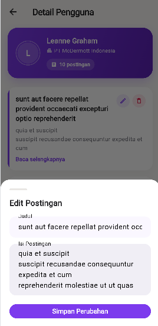
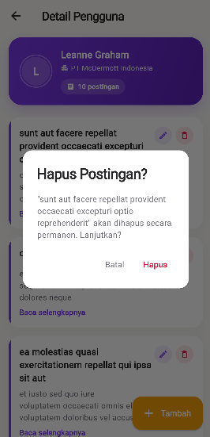

# 📱 UserConnect

Aplikasi mobile **CRUD sederhana** yang dibangun sebagai **Technical Assessment Mobile Developer Intern**.

Aplikasi ini menggunakan **REST API** dari:
> https://jsonplaceholder.typicode.com

---

# ✨ Features

## 👥 Home Screen
- Menampilkan daftar pengguna dari endpoint `GET /users`
- Informasi yang ditampilkan:
  - Nama
  - Email
  - Perusahaan

## 📝 Post Detail Screen
Melakukan CRUD penuh terhadap postingan milik setiap user (`/posts?userId={id}`).

### ➕ Create
- Menambahkan postingan baru melalui **Bottom Sheet**
- Menggunakan **Optimistic UI Update**
  - Post langsung muncul di bagian atas list
  - Tidak perlu refresh halaman

### 📖 Read
- Menampilkan seluruh postingan milik user

### ✏️ Update
- Mengubah judul dan isi postingan

### 🗑 Delete
- Menghapus postingan menggunakan dialog konfirmasi

---

# 🎨 UI / UX

- 🎨 Custom Theme (Violet + Amber)
- ✨ Manual Shimmer Loading (tanpa package tambahan)
- 📭 Empty State yang informatif
- ⚠️ Error State ketika koneksi gagal
- 🔔 Snackbar feedback untuk setiap aksi CRUD
- 📝 Overflow handling untuk:
  - Nama
  - Email
  - Isi postingan

---

# 🧠 Mengapa Memilih Provider?

Provider dipilih karena paling sesuai dengan skala aplikasi dan mudah dipelajari saat proses live code review.

### 1. Sesuai dengan kompleksitas aplikasi

Aplikasi hanya memiliki **2 halaman** dengan state yang sederhana:

- Daftar User (global)
- Daftar Post per User (lokal)

Menggunakan Bloc, Riverpod, atau GetX akan menambah boilerplate yang tidak sebanding dengan kompleksitas aplikasi.

---

### 2. Alur state management sederhana

Provider hanya memiliki tiga konsep utama:

```
ChangeNotifier
        │
notifyListeners()
        │
Consumer / context.watch()
```

Sehingga alur perubahan data mudah dipahami dan dijelaskan ketika live coding.

---

### 3. Direkomendasikan oleh Flutter

Provider merupakan state management yang direkomendasikan oleh tim Flutter untuk banyak use case umum.

Keunggulannya:

- stabil
- matang
- minim breaking changes
- mudah dipelihara

---

### 4. Scope Provider dipisahkan

**UserProvider**

- dibuat satu kali di `main.dart`
- digunakan sepanjang lifecycle aplikasi

```
MultiProvider
    └── UserProvider
```

Sedangkan

**PostProvider**

- dibuat setiap kali `PostDetailScreen` dibuka
- otomatis di-dispose ketika halaman ditutup

```
PostDetailScreen
      │
ChangeNotifierProvider
      │
 PostProvider
```

Dengan cara ini:

- data post User A tidak bercampur dengan User B
- state lama otomatis dibersihkan

---

### 5. Trade-off

Untuk aplikasi yang jauh lebih kompleks (nested state, dependency banyak, atau membutuhkan time-travel debugging), **Bloc** atau **Riverpod** merupakan pilihan yang lebih baik.

Namun untuk technical assessment dengan scope CRUD sederhana, **Provider** memberikan keseimbangan terbaik antara:

- kesederhanaan
- maintainability
- readability
- kecepatan development

---

# 🔄 Application Flow

```text
main.dart
│
└── MultiProvider
    │
    └── UserProvider
        │
        └── HomeScreen
            │
            ├── fetchUsers()
            │      └── GET /users
            │
            ├── Loading
            │      └── Shimmer
            │
            ├── Error
            │      └── Retry
            │
            ├── Empty
            │      └── Info State
            │
            └── Tap User
                   │
                   └── PostDetailScreen
                           │
                           └── ChangeNotifierProvider
                                   │
                                   └── PostProvider
                                           │
                                           ├── fetchPosts()
                                           │      └── GET /posts?userId={id}
                                           │
                                           ├── Add Post
                                           │      ├── Optimistic Insert
                                           │      └── POST /posts
                                           │
                                           ├── Edit Post
                                           │      ├── Optimistic Update
                                           │      └── PUT /posts/{id}
                                           │
                                           └── Delete Post
                                                  ├── Optimistic Remove
                                                  └── DELETE /posts/{id}
```

---

# 📂 Project Structure

```text
lib/
│
├── main.dart
│
├── theme/
│   └── app_theme.dart
│
├── models/
│   ├── user_model.dart
│   └── post_model.dart
│
├── services/
│   └── api_service.dart
│
├── providers/
│   ├── user_provider.dart
│   └── post_provider.dart
│
├── widgets/
│   ├── shimmer_box.dart
│   ├── state_widgets.dart
│   ├── user_card.dart
│   ├── post_card.dart
│   └── add_edit_post_sheet.dart
│
└── screens/
    ├── home_screen.dart
    └── post_detail_screen.dart
```

---

# 📸 Screenshots

| Home Screen | Detail Screen |
|-------------|---------------|
|  |  |

| Tambah Post | Edit Post |
|-------------|-----------|
|  |  |

| Hapus Post |
|------------|
|  |

---

# 🛠 Tech Stack

- Flutter
- Dart
- Provider
- REST API
- HTTP
- JSONPlaceholder

---

# 📌 API

Semua data berasal dari:

**JSONPlaceholder**

https://jsonplaceholder.typicode.com

Endpoint yang digunakan:

- `GET /users`
- `GET /posts?userId={id}`
- `POST /posts`
- `PUT /posts/{id}`
- `DELETE /posts/{id}`

---

# 🚀 Cara Menjalankan Project

```bash
git clone <repository-url>

cd UserConnect

flutter pub get

flutter run
```